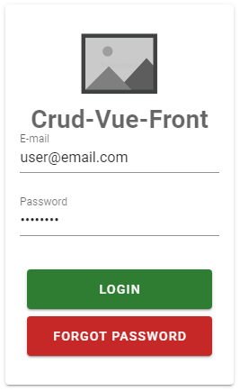
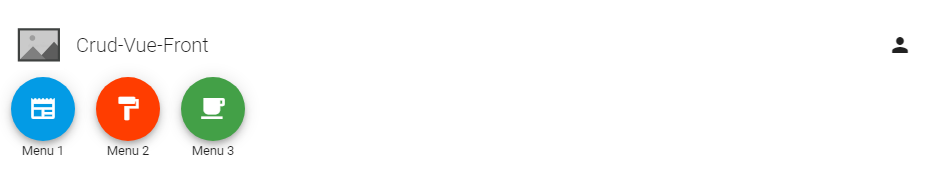

<!--
*** Thanks for checking out the Best-README-Template. If you have a suggestion
*** that would make this better, please fork the repo and create a pull request
*** or simply open an issue with the tag "enhancement".
*** Thanks again! Now go create something AMAZING! :D
***
***
***
*** To avoid retyping too much info. Do a search and replace for the following:
*** github_username, repo_name, twitter_handle, email, project_title, project_description
-->


<!-- PROJECT SHIELDS -->
<!--
*** I'm using markdown "reference style" links for readability.
*** Reference links are enclosed in brackets [ ] instead of parentheses ( ).
*** See the bottom of this document for the declaration of the reference variables
*** for contributors-url, forks-url, etc. This is an optional, concise syntax you may use.
*** https://www.markdownguide.org/basic-syntax/#reference-style-links
-->
[![Contributors][contributors-shield]][contributors-url]
[![Forks][forks-shield]][forks-url]
[![Stargazers][stars-shield]][stars-url]
[![Issues][issues-shield]][issues-url]
[![GNU License][license-shield]][license-url]


<!-- PROJECT LOGO -->
<br />
<p align="center">
  <a href="https://github.com/vcampos13/crud-vue-front">
    
  </a>

  <h3 align="center">Crud-Vue-Front</h3>

  <p align="center">
    Project created with the intention of learning the development of a front-end application in VUE.JS that will consume information from a PHP backend API.
    <br />
    <br />
    <!-- <a href="https://github.com/vcampos13/crud-vue-front">View Demo</a> -->
    <!-- · -->
    <a href="https://github.com/vcampos13/crud-vue-front/issues">Report Bug</a>
    ·
    <a href="https://github.com/vcampos13/crud-vue-front/issues">Request Feature</a>
  </p>
</p>


<!-- TABLE OF CONTENTS -->
<details open="open">
  <summary><h2 style="display: inline-block">Table of Contents</h2></summary>
  <ol>
    <li>
      <a href="#about-the-project">About The Project</a>
      <ul>
        <li><a href="#built-with">Built With</a></li>
      </ul>
    </li>
    <li>
      <a href="#getting-started">Getting Started</a>
      <ul>
        <li><a href="#prerequisites">Prerequisites</a></li>
        <li><a href="#installation">Installation</a></li>
      </ul>
    </li>
    <li><a href="#contributing">Contributing</a></li>
    <li><a href="#license">License</a></li>
    <li><a href="#contact">Contact</a></li>
    <li><a href="#acknowledgements">Acknowledgements</a></li>
  </ol>
</details>


<!-- ABOUT THE PROJECT -->
## About The Project

<p align="center">
    
</p>

The project was created to send JSON commands to the backend, which will perform the Login / Logoff procedures and the basic CRUD in a table in the database.


### Built With

* [Vue.js](https://vuejs.org/)
* [Vuetify](https://vuetifyjs.com/)
* [Axios](https://github.com/axios/axios)
* [Vue-i18n](https://github.com/kazupon/vue-i18n)

<!-- GETTING STARTED -->
## Getting Started

### Prerequisites

To execute this project it is necessary to have the back-end found in the following repository:<br>
[crud-api-back](https://github.com/vcampos13/crud-api-back/)

### Installation

1. Clone the repo
   ```sh
   git clone https://github.com/vcampos13/crud-vue-front.git
   ```
2. Install using yarn 
   ```sh
   yarn install
   ```

<!-- CONTRIBUTING -->
## Contributing

Contributions are what make the open source community such an amazing place to be learn, inspire, and create. Any contributions you make are **greatly appreciated**.

1. Fork the Project
2. Create your Feature Branch (`git checkout -b feature/AmazingFeature`)
3. Commit your Changes (`git commit -m 'Add some AmazingFeature'`)
4. Push to the Branch (`git push origin feature/AmazingFeature`)
5. Open a Pull Request


<!-- LICENSE -->
## License

Distributed under the GNU License. See `LICENSE` for more information.


<!-- CONTACT -->
## Contact

Victor Campos - [Linkedin](https://www.linkedin.com/in/vcamposin/)

victor.campos13@gmail.com

Project Link: [https://github.com/vcampos13/crud-vue-front](https://github.com/vcampos13/crud-vue-front)


<!-- ACKNOWLEDGEMENTS -->
## Acknowledgements

* [Material Design Icons](https://pictogrammers.github.io/@mdi/font/2.0.46/)
* [Vuetify Colors](https://vuetifyjs.com/en/styles/colors/)

<!-- MARKDOWN LINKS & IMAGES -->
<!-- https://www.markdownguide.org/basic-syntax/#reference-style-links -->
[contributors-shield]: https://img.shields.io/github/contributors/vcampos13/crud-vue-front
[contributors-url]: https://github.com/vcampos13/crud-vue-front/graphs/contributors
[forks-shield]: https://img.shields.io/github/forks/vcampos13/crud-vue-front
[forks-url]: https://img.shields.io/github/forks/vcampos13/crud-vue-front
[stars-shield]: https://img.shields.io/github/stars/vcampos13/crud-vue-front
[stars-url]: https://github.com/vcampos13/crud-vue-front/stargazers
[issues-shield]: https://img.shields.io/github/issues/vcampos13/crud-vue-front
[issues-url]: https://github.com/vcampos13/crud-vue-front/issues
[license-shield]: https://img.shields.io/github/license/vcampos13/crud-vue-front
[license-url]: https://github.com/vcampos13/crud-vue-front/blob/master/LICENSE.txt
